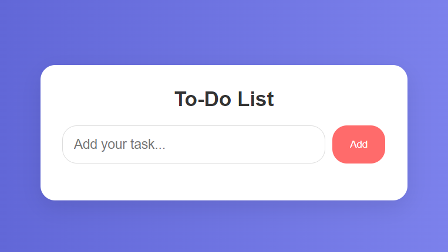

# To-Do List Project

This project is a simple and interactive To-Do List built using **HTML**, **CSS**, and **JavaScript**. It allows users to add tasks, mark them as completed, and delete them from the list. The design is clean and user-friendly, ensuring an intuitive experience for managing tasks.

## Table of Contents
- [ScreenShot](#screenshot)
- [Features](#features)
- [Built With](#built-with)
- [Prerequisites](#prerequisites)
- [Usage](#usage)
- [Contact](#contact)

## ScreenShot




<p align="right">(<a href="#table-of-contents">back to top</a>)</p>

## Features

- **Add New Task**: Users can add new tasks by typing in the input field and clicking the "Add" button.
- **Mark Task as Completed**: Users can mark tasks as completed by clicking the green check button. The task will be shown with a strike-through effect.
- **Delete Task**: Users can delete tasks using the red delete button.
- **Responsive Design**: The layout adjusts nicely on various screen sizes.
- **Persistent Styling**: Completed tasks change in appearance without affecting the delete functionality.

<p align="right">(<a href="#table-of-contents">back to top</a>)</p>

## Built With

This project was built using the following technologies:

* 
* 
* 

<p align="right">(<a href="#table-of-contents">back to top</a>)</p>

## Prerequisites

To run this project, you only need a modern web browser that supports HTML, CSS, and JavaScript. No additional dependencies or libraries are required.

<p align="right">(<a href="#table-of-contents">back to top</a>)</p>

## Usage

1. Clone the project repository:
   ```bash
   git clone https://github.com/AmirrezaAhmadi/To-Do-List-App.git

2. Open the ToDo-List App.Html file in your browser.

<p align="right">(<a href="#table-of-contents">back to top</a>)</p>

## Contact

You can reach me through the following:

* Email: AmirrezaAhmadi.GH@Gmail.com
* Telegram: https://t.me/AmirrezaDevelop
* Instagram: https://www.instagram.com/codewithamirreza
* Project Link: https://github.com/AmirrezaAhmadi/To-Do-List-App.git

<p align="right">(<a href="#table-of-contents">back to top</a>)</p>